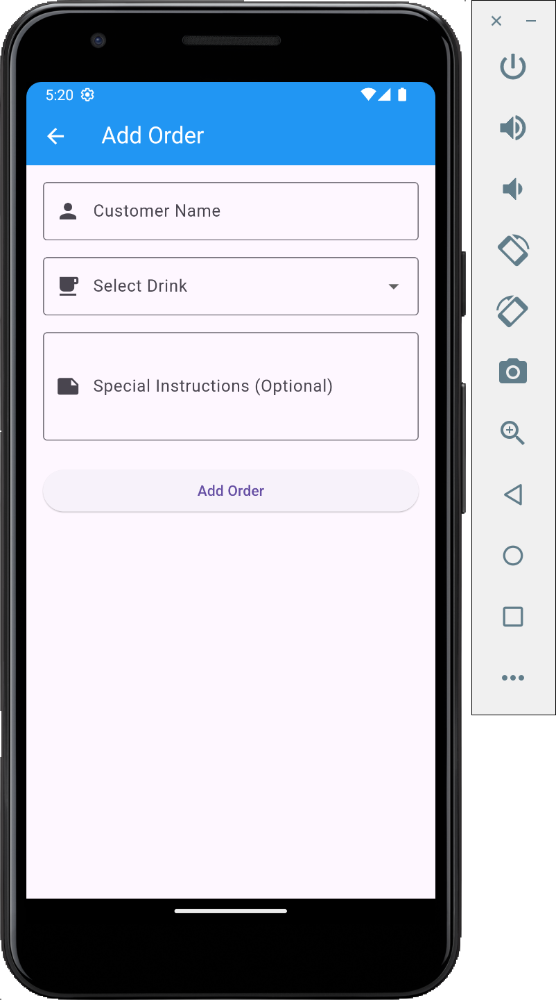
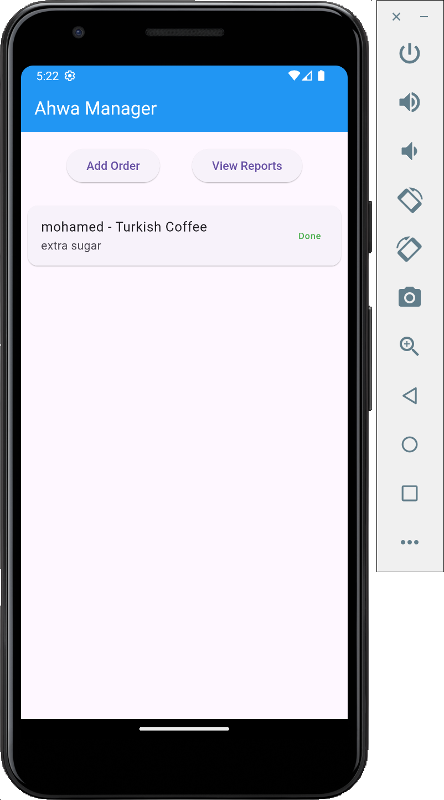
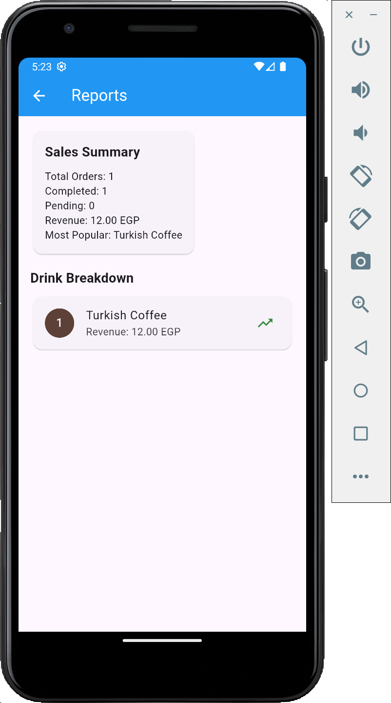

# Smart Ahwa Manager

A Flutter application demonstrating SOLID principles and Object-Oriented Programming concepts through a simple Egyptian coffee shop management system.

## Screenshots

### Add Order Screen


The add order screen allows users to input customer details, select drinks, and add special instructions.

### Main Dashboard


The main screen displays all orders with simple navigation buttons and shows completed orders with "Done" status.

### Reports Screen


The reports screen provides sales summary and drink breakdown with revenue tracking.

## SOLID Principles Implementation

### Single Responsibility Principle (SRP)
- **OrderManager**: Only handles order operations (create, retrieve, complete)
- **ReportGenerator**: Only responsible for generating sales reports
- **DrinkFactory**: Only manages drink object creation
- Each class has one clear purpose and reason to change

### Open/Closed Principle (OCP)
- **Drink Hierarchy**: New drink types can be added by extending the abstract `Drink` class without modifying existing code
- The system is open for extension but closed for modification

### Liskov Substitution Principle (LSP)
- Any concrete drink class (`Shai`, `TurkishCoffee`, `HibiscusTea`) can replace the abstract `Drink` class seamlessly
- Polymorphic behavior ensures consistent functionality

### Interface Segregation Principle (ISP)
- Focused interfaces with only necessary methods
- `Drink` interface contains only essential properties and methods

### Dependency Inversion Principle (DIP)
- High-level modules depend on abstractions (abstract `Drink` class) rather than concrete implementations
- Service injection through constructor parameters

## Object-Oriented Programming Concepts

### Encapsulation
- **Private fields** in `Order` class (`_id`, `_customerName`, `_status`) with public getters
- **Data validation** in constructors prevents invalid object creation
- **Controlled access** to internal state through specific methods

### Inheritance
- **Abstract `Drink` class** provides common structure
- **Concrete classes** (`Shai`, `TurkishCoffee`, `HibiscusTea`) inherit and implement specific behaviors
- **Code reuse** through shared properties and methods

### Polymorphism
- **Different drink types** implement `prepare()` method differently while sharing the same interface
- **Runtime behavior** varies based on the actual drink type selected

### Abstraction
- **Abstract `Drink` class** defines what all drinks must have without specifying implementation details
- **Service layer** abstracts business logic from UI concerns
- **Factory pattern** hides object creation complexity

## Features

- Add customer orders with drink selection and special instructions
- View all orders in a simple list format
- Mark orders as completed
- Generate sales reports with revenue tracking
- Track most popular drinks

## Project Structure

```
lib/
├── models/          # Data models (Order, Drink, OrderStatus)
├── services/        # Business logic (OrderManager, ReportGenerator, DrinkFactory)
├── screens/         # UI screens (Home, AddOrder, Reports)
├── widgets/         # Reusable components (OrderTile)
└── main.dart        # App entry point
```

## How to Run

1. Ensure Flutter is installed on your system
2. Clone this repository
3. Run `flutter pub get` to install dependencies
4. Run `flutter run` to start the application

This implementation demonstrates clean architecture principles with clear separation of concerns, making the code maintainable, testable, and extensible.
# flutter-cofee-shop-solid-oop
